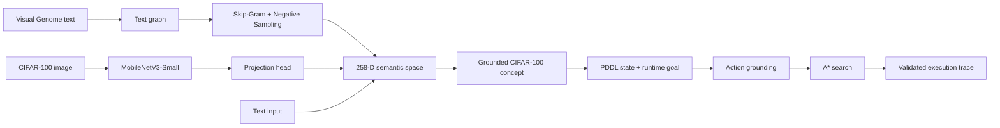

# Neuro-Symbolic AI Planner

### From visual and textual concepts to validated symbolic action plans

An end-to-end neuro-symbolic AI system connecting **computer vision**, **learned semantic representations**, **evolutionary optimisation** and **symbolic planning**.

The system grounds an image or text input into a shared semantic embedding space, maps it to a supported CIFAR-100 concept, constructs a symbolic planning state and uses grounded PDDL actions with A* search to produce an explicit, validated action sequence.

## System architecture



## Highlights

| Component | Implementation |
| --- | --- |
| Semantic representation | Skip-Gram with Negative Sampling |
| Embedding dimension | **258** |
| Final semantic vocabulary | **523 tokens** |
| Best reported Skip-Gram validation loss | **2.9496** |
| Vocabulary expansion | (1+λ) evolutionary strategy |
| Vision backbone | MobileNetV3-Small |
| Vision-language alignment | Learned projection into the shared semantic space |
| Symbolic representation | PDDL-style predicates, actions and states |
| Search | BFS and unit-cost A* |
| Final verification | Plan replay checks action applicability and goal satisfaction |

## What I implemented

- graph construction from natural-language text;
- Skip-Gram with Negative Sampling in PyTorch;
- deterministic hyperparameter search and embedding analysis;
- evolutionary insertion of previously unseen CIFAR-100 concepts;
- MobileNetV3-based visual encoding with a trainable semantic projection head;
- contrastive image-to-text alignment utilities;
- PDDL parsing and symbolic state representation;
- action-schema grounding and search-space pruning;
- BFS and A* planning;
- multimodal integration that accepts image or text input and returns a validated execution trace.

## Semantic representation

The language component learns word representations from a graph derived from Visual Genome region descriptions.

The selected Skip-Gram configuration used:

- embedding dimension: **258**;
- context window: **4**;
- negative samples: **5**;
- learning rate: **0.003**;
- dropout: **0.1**;
- weight decay: **1e-5**;
- early stopping patience: **5**.

The best reported validation loss was **2.9496**. The resulting embedding space was then expanded using evolutionary optimisation so that the final vocabulary covered the CIFAR-100 concepts required by the multimodal pipeline.

## Visual grounding

CIFAR-100 images are encoded by a MobileNetV3-Small backbone and passed through a learned projection head. The projected representation is compared with semantic class embeddings using cosine similarity, allowing visual inputs to be grounded into the same concept space as text.

## Symbolic planning

The repository includes the PDDL domain and base world state used by the final integration.

`planning/domain.pddl` defines the symbolic actions, predicates, locations and tool constants. `planning/problem.pddl` provides the default CIFAR-100 world state. The requested goal is supplied at runtime by the Python API.

After grounding the input concept, the system:

1. constructs the initial symbolic state;
2. grounds applicable action schemas;
3. searches the reachable state space using A*;
4. replays the resulting plan step by step;
5. verifies every precondition and confirms that the final state satisfies the goal.

## Example

```python
from neurosymbolic.pipeline import generate_plan

plan = generate_plan(
    input_data="apple",
    initial_state={
        "(agent-at lab)",
        "(holding knife)",
        "(at apple lab)",
        "(whole apple)",
        "(clear apple)",
    },
    goal_state={"(cut-into-pieces apple)"},
)

for step in plan or []:
    print(step)
```

Each returned step records the selected action together with the predicates added to and removed from the symbolic state.

## Repository structure

```text
neuro-symbolic-ai-planner/
├── neurosymbolic/
│   ├── pipeline.py
│   ├── text_graph.py
│   ├── semantic_embeddings.py
│   ├── embedding_expansion.py
│   ├── vision_alignment.py
│   └── symbolic_planner.py
├── planning/
│   ├── domain.pddl
│   ├── problem.pddl
│   └── README.md
├── models/
│   ├── semantic_embeddings.pth
│   └── visual_projection.pth
├── requirements.txt
└── README.md
```

## Installation

```bash
python -m venv .venv
source .venv/bin/activate
pip install -r requirements.txt
```

## Included artefacts

The repository includes the trained semantic embedding checkpoint, the trained visual projection checkpoint and the symbolic planning files required by the integration pipeline.

Large source datasets such as CIFAR-100 and Visual Genome are not committed to Git.

## Why neuro-symbolic?

The learned components answer **what concept is present**, while the symbolic component determines **which actions are valid and how to reach a goal**.

Keeping those stages separate makes the reasoning trace inspectable: unlike an opaque end-to-end policy, the planner returns explicit actions and state changes that can be validated after search.

## Tech

**Python · PyTorch · torchvision · MobileNetV3 · Skip-Gram · contrastive learning · evolutionary optimisation · NetworkX · CIFAR-100 · PDDL · A* search**
